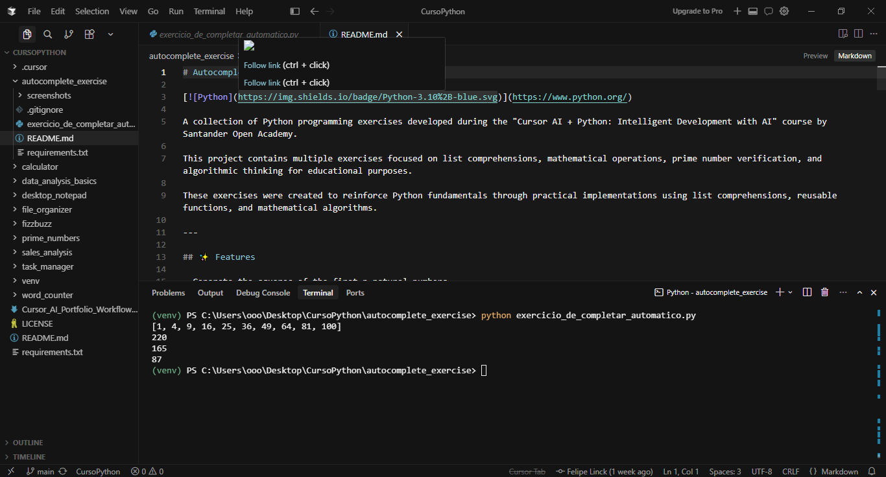

# Autocomplete Exercise

[](https://www.python.org/)

A collection of introductory Python programming exercises developed during the "Cursor AI + Python: Intelligent Development with AI" course by Santander Open Academy.

This project features a set of beginner-friendly Python exercises focused on list comprehensions, basic functions, conditional logic, mathematical operations, prime number verification, and foundational algorithmic thinking.  
The project name reflects the educational context of code-completion/autocomplete practice and does not represent an autocomplete or AI system.

---

## ✨ Features

- Generate a list of squares of natural numbers from 1 to n
- Calculate the sum of the squares of even numbers from a given list
- Calculate the sum of the squares of odd numbers from a given list
- Check if a number is prime using a basic trial-division algorithm
- Calculate the sum of the squares of prime numbers from a given list
- Demonstrate Python list comprehensions and reusable functions

---

## 🛠 Technologies Used

- Python 3.10+
- Python Standard Library

> This project uses only the Python Standard Library. No external packages are required at runtime.

---

## 📂 Project Structure

```text
autocomplete_exercise/
│
├── exercicio_de_completar_automatico.py         # Collection of introductory Python exercises
├── screenshots/
│   └── autocomplete_exercise_preview.png        # Screenshot of exercise execution
├── README.md                                    # Project documentation
├── requirements.txt                             # (Optional) Placeholder for dependencies; none required at runtime
└── .gitignore                                   # Standard Python ignore rules
```

---

## 🚀 Installation

1. Clone the repository:

   ```bash
   git clone https://github.com/Linck-creator/cursor-ai-python-journey.git
   ```

2. Change to the project directory:

   ```bash
   cd cursor-ai-python-journey/autocomplete_exercise
   ```

3. (Optional) Create and activate a virtual environment:

<details>
  <summary>Windows (PowerShell)</summary>

   ```powershell
   python -m venv venv
   .\venv\Scripts\Activate.ps1
   ```

</details>

<details>
  <summary>Unix / macOS</summary>

   ```bash
   python -m venv venv
   source venv/bin/activate
   ```

</details>

> This project uses only the Python Standard Library. No external packages are required at runtime.

---

## ▶️ Usage

Run the script from the project directory:

```bash
python exercicio_de_completar_automatico.py
```

The script sequentially executes a series of example exercises and prints four results:

```
[1, 4, 9, 16, 25, 36, 49, 64, 81, 100]
220
165
87
```

These outputs represent:

- The list of squares from 1² through 10²
- The sum of the squares of even numbers in the list 1 to 10
- The sum of the squares of odd numbers in the list 1 to 10
- The sum of the squares of prime numbers in the list 1 to 10

---

## 📸 Preview

### Exercise Execution



The screenshot above shows the program's successful execution in the terminal, displaying the results for the collection of predefined Python exercises.

---

## 📚 Learning Objectives

- Python functions and modular decomposition
- List comprehensions
- Loops and conditional statements
- Mathematical operations and the modulo operator
- Prime number verification (basic trial division)
- Working with lists
- Writing reusable functions
- Algorithmic thinking and basic problem-solving

---

## 🔮 Future Improvements

- Add interactive user input for custom lists or ranges
- Improve the prime number verification algorithm
- Separate each exercise into individual modules
- Add automated tests
- Add type hints and a main execution guard
- Expand the collection with additional exercises

---

## 👨‍💻 Author

Developed by **Felipe Coelho Linck**

Administration Student | Python Developer | AI-Assisted Software Development

Created during the **Cursor AI + Python: Intelligent Development with AI** course provided by **Santander Open Academy**.