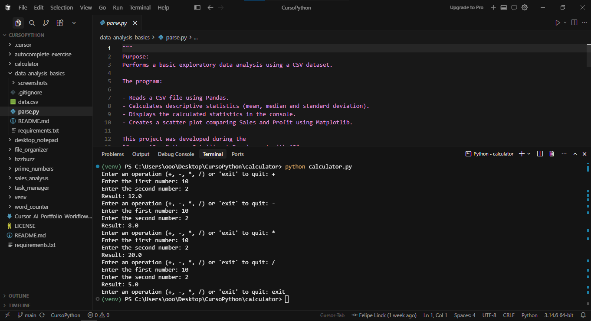

# Calculator

[](https://www.python.org/)

A basic command-line calculator built with Python. Allows users to perform addition, subtraction, multiplication, and division interactively, with input validation and error handling for invalid input and division by zero.

---

## ✨ Features

- Addition, subtraction, multiplication, and division
- Interactive user input via the command line
- Continuous calculation loop (performs repeated calculations until "exit" is entered)
- Typing `"exit"` ends the session
- Handles invalid operations with clear error messages
- Handles invalid numeric input with error messages
- Division by zero is gracefully handled with an error message

---

## 🛠 Technologies Used

- Python 3.10+
- Uses only the Python Standard Library (no external dependencies)

---

## 📂 Project Structure

```text
calculator/
│
├── calculator.py
├── screenshots/
│   └── calculator_preview.png
├── README.md
├── requirements.txt
└── .gitignore
```

---

## 🚀 Installation

1. **Clone the repository**
   ```bash
   git clone https://github.com/Linck-creator/cursor-ai-python-journey.git
   ```
2. **Change to the project directory**
   ```bash
   cd cursor-ai-python-journey/calculator
   ```
3. **(Optional) Create and activate a virtual environment**

   <details>
   <summary><b>Windows (PowerShell)</b></summary>

   ```powershell
   python -m venv venv
   .\venv\Scripts\Activate.ps1
   ```

   </details>

   <details>
   <summary><b>Unix / macOS</b></summary>

   ```bash
   python -m venv venv
   source venv/bin/activate
   ```

   </details>

4. **Dependencies**
   > This project uses only Python's built-in functionality. No external packages are required at runtime.

---

## ▶️ Usage

Run the calculator with:

```bash
python calculator.py
```

Interaction flow:
1. When prompted, enter one of the following operations: `+`, `-`, `*`, `/` or type `exit` to quit.
2. If an operation is selected, enter the first number when asked.
3. Enter the second number.
4. The calculator will show the result of the calculation.
5. Errors will be displayed for invalid number inputs, unsupported operations, or division by zero.
6. The loop repeats until "exit" is entered.

---

## 📸 Preview

### Command-Line Calculator



The above screenshot shows the calculator performing all four arithmetic operations from the terminal and exiting normally when the user types "exit".

---

## 📚 Learning Objectives

- Python functions and main entrypoint usage
- Command-line user input
- Arithmetic operations
- Conditional statements
- Loops
- Error handling with try/except
- Type conversion of user input

---

## 🔮 Future Improvements

- Support for additional mathematical operations (e.g. exponentiation, modulus)
- Calculation history tracking
- Expression evaluation
- Unit tests
- Graphical user interface (GUI)
- Enhanced command-line interface and argument support

---

## 👨‍💻 Author

Developed by **Felipe Coelho Linck**  
Administration Student | Python Developer | AI-Assisted Software Development

Created during the **Cursor AI + Python: Intelligent Development with AI** course provided by **Santander Open Academy**.