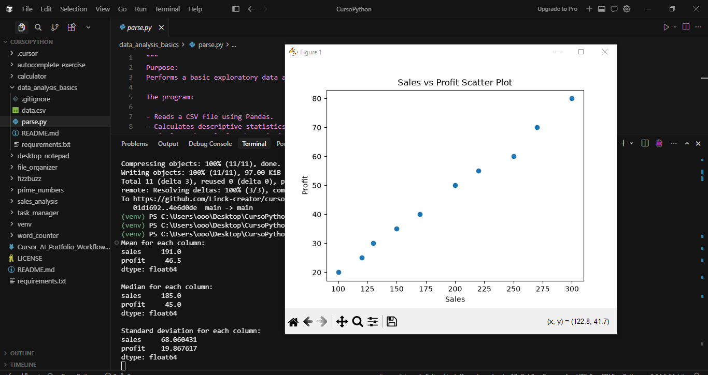

# Data Analysis Basics 

[](https://www.python.org/)

A concise introductory project demonstrating basic exploratory data analysis using a CSV dataset with Python, Pandas, and Matplotlib. The script loads tabular data, computes descriptive statistics (mean, median, standard deviation) for each column, prints these results in the terminal, and visualizes the relationship between sales and profit with a scatter plot.

---

## ✨ Features

- Reads data from a CSV file
- Loads the dataset into a Pandas DataFrame
- Calculates and prints the mean, median, and standard deviation for each column
- Displays descriptive statistics in the terminal
- Generates a Sales vs Profit scatter plot using Matplotlib

---

## 🛠 Technologies Used

- Python 3.10+
- Pandas
- Matplotlib

---

## 📂 Project Structure

```text
data_analysis_basics/
│
├── parse.py
├── data.csv
├── screenshots/
│   └── data_analysis_basics_preview.png
├── README.md
├── requirements.txt
└── .gitignore
```

---

## 🚀 Installation

1. Clone the repository:

   ```bash
   git clone https://github.com/Linck-creator/cursor-ai-python-journey.git
   cd cursor-ai-python-journey/data_analysis_basics
   ```

2. (Optional) Create and activate a virtual environment.

<details>
  <summary>Windows (PowerShell)</summary>

  ```bash
  python -m venv venv
  .\venv\Scripts\Activate.ps1
  ```
</details>

<details>
  <summary>Unix / macOS</summary>

  ```bash
  python -m venv venv
  source venv/bin/activate
  ```
</details>

3. Install dependencies:

   ```bash
   pip install -r requirements.txt
   ```

---

## ▶️ Usage

To run the exploratory data analysis:

```bash
python parse.py
```

The script will:

- Load the dataset from `data.csv`
- Compute and print mean, median, and standard deviation for each column to the terminal
- Display a Matplotlib scatter plot comparing Sales (X-axis) and Profit (Y-axis)

---

## 📸 Preview

### Exploratory Data Analysis



The screenshot shows the project running successfully, with descriptive statistics printed in the terminal and a Sales vs Profit scatter plot displayed using Matplotlib.

---

## 📚 Learning Objectives

- Reading CSV files with Pandas
- Working with DataFrames for analysis
- Performing basic descriptive statistics: mean, median, standard deviation
- Visualizing relationships between variables using a scatter plot with Matplotlib
- Practicing basic exploratory data analysis in Python

---

## 🔮 Future Improvements

- Support for analyzing custom user-provided CSV files
- Additional chart types (e.g., histograms, box plots)
- Correlation analysis between variables
- Handling missing or invalid data
- Exporting analysis results to a file
- Enhanced plot customization and interactivity

---

## 👨‍💻 Author

Developed by **Felipe Coelho Linck**

Administration Student | Python Developer | AI-Assisted Software Development

Created during the **Cursor AI + Python: Intelligent Development with AI** course provided by **Santander Open Academy**.