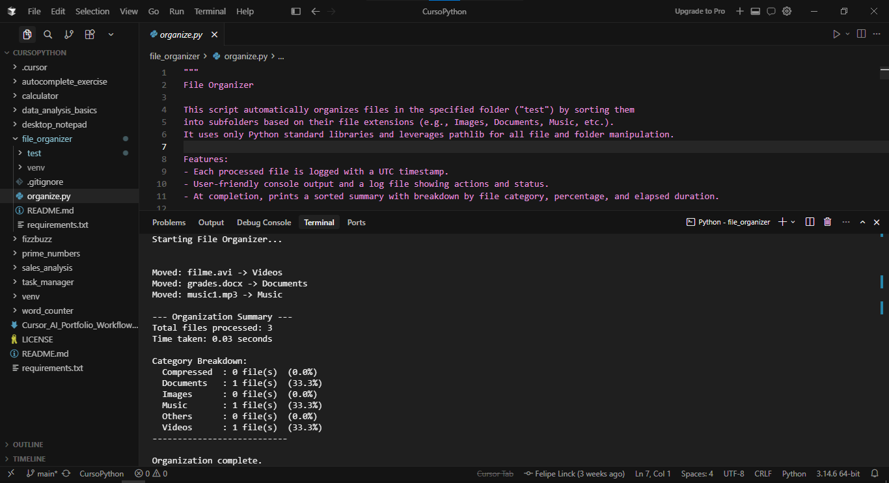

# File Organizer

[](https://www.python.org/)

A professional file automation script that automatically organizes files into categorized folders by extension, using only Python standard libraries.

---

## ✨ Features

- Automatically organize files into categorized folders
- Categorize files by extension
- Automatically create category folders
- Prevent filename collisions
- Generate organization logs
- Display organization summary
- Calculate category percentages
- Measure execution time

---

## 🛠 Technologies Used

- Python 3.10+
- Python Standard Library
  - pathlib
  - shutil
  - datetime
  - time
  - typing

---

## 📂 Project Structure

```text
file_organizer/
│
├── organize.py
├── test/
├── screenshots/
│   └── file_organizer_preview.png
├── README.md
├── requirements.txt
└── .gitignore
```

---

## 🚀 Installation

1. Clone the repository:

```bash
git clone https://github.com/Linck-creator/cursor-ai-python-journey.git
cd cursor-ai-python-journey/file_organizer
```

2. (Optional) Create and activate a virtual environment.

<details>
  <summary>Windows (PowerShell)</summary>

```bash
python -m venv venv
.\venv\Scripts\Activate.ps1
```

</details>

<details>
  <summary>Unix / macOS</summary>

```bash
python -m venv venv
source venv/bin/activate
```

</details>

3. Install project dependencies:

```bash
pip install -r requirements.txt
```

> This project uses only the Python Standard Library. No external packages are required at runtime.

---

## ▶️ Usage

To organize your files, follow these steps:

1. Place the files you want to organize **directly** inside the `test/` folder.
   - Only files located directly inside `test/` will be processed. Existing subfolders and their contents are not scanned.

2. Run the script:

```bash
python organize.py
```

3. The script will automatically:
   - Detect each file extension.
   - Move each file into a corresponding category subfolder, based on its extension.
   - Create category folders as needed. The implemented categories are:
     - Compressed
     - Documents
     - Images
     - Music
     - Videos
     - Others

   Files with extensions not recognized in the predefined categories are placed in the `Others` folder.

Additional behavior:
- Category folders are always created as necessary.
- If a file name would overwrite an existing file, the script generates a unique filename.
- All processing is logged to `test/organization.log`.
- After processing, the script displays a summary in the terminal, showing the total number of files processed, execution time, category breakdowns, and percentages.

---

## 📸 Preview

### File Organization Execution



The screenshot shows a successful execution of the File Organizer, including files being automatically moved to their corresponding categories and the final organization summary with processed files, category distribution, percentages, and execution time.

---

## 📚 Learning Objectives

- File system automation
- Working with pathlib
- File handling
- Directory management
- Logging
- Exception handling
- Performance measurement
- Modular programming

---

## 🔮 Future Improvements

- Recursive directory support
- User-selected folders
- Configuration file
- Drag-and-drop support
- Progress bar
- Undo operation
- Command-line argument support

---

## 👨‍💻 Author

Developed by **Felipe Coelho Linck**

Administration Student | Python Developer | AI-Assisted Software Development

Created during the **Cursor AI + Python: Intelligent Development with AI** course provided by **Santander Open Academy**.

━━━━━━━━━━━━━━━━━━━━━━━━━━━━━━━━━━━━━━