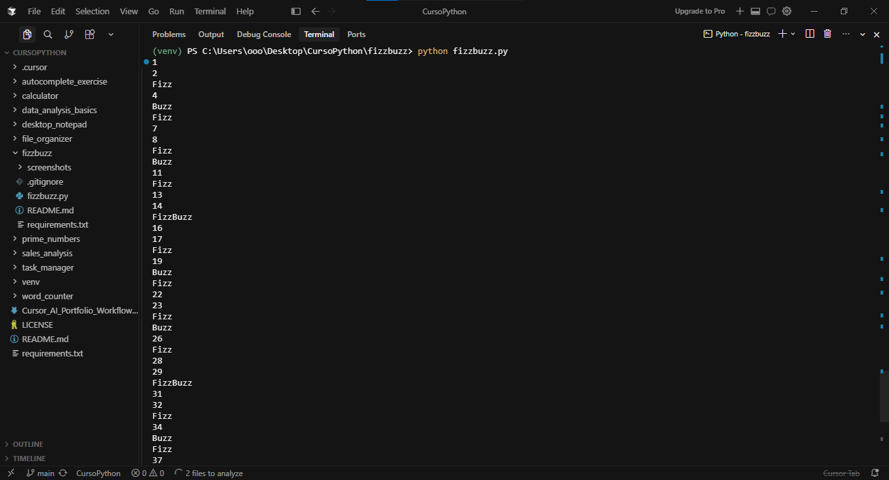

# FizzBuzz

[](https://www.python.org/)

A simple Python program that prints numbers from 1 to 50. For multiples of 3, it prints "Fizz"; for multiples of 5, it prints "Buzz"; and for multiples of both 3 and 5, it prints "FizzBuzz". This classic problem demonstrates conditional logic and iteration in Python.

## ✨ Features

- Prints numbers from 1 to 50 with FizzBuzz logic
- Clearly illustrates the use of conditionals and loops

## 🛠 Technologies Used

- Python 3.10+
- Python Standard Library

## 📂 Project Structure

```text
fizzbuzz/
│
├── fizzbuzz.py
├── screenshots/
│   └── fizzbuzz_preview.png
├── README.md
├── requirements.txt
└── .gitignore
```

## 🚀 Installation

1. Clone the repository:
   ```bash
   git clone https://github.com/Linck-creator/cursor-ai-python-journey.git
   cd cursor-ai-python-journey/fizzbuzz
   ```

2. (Optional) Create and activate a virtual environment.

<details>
  <summary>Windows (PowerShell)</summary>

  ```bash
  python -m venv venv
  .\venv\Scripts\Activate.ps1
  ```
</details>

<details>
  <summary>Unix / macOS</summary>

  ```bash
  python -m venv venv
  source venv/bin/activate
  ```
</details>

> This project uses only the Python Standard Library. No external packages are required at runtime.

## ▶️ Usage

Run the FizzBuzz program:

```bash
python fizzbuzz.py
```

**Example output:**
```
1
2
Fizz
4
Buzz
Fizz
7
8
Fizz
Buzz
11
Fizz
13
14
FizzBuzz
...
50
```

## 📸 Preview

### FizzBuzz Execution



The screenshot shows the FizzBuzz program running successfully in the terminal, printing numbers from 1 to 50 and applying the expected FizzBuzz rules: multiples of 3 are displayed as "Fizz", multiples of 5 as "Buzz", and multiples of both as "FizzBuzz".

---

## 📚 Learning Objectives

- Iteration with `for` loops
- Conditional statements (`if`, `elif`, `else`)
- Arithmetic operators and modulo (`%`)
- Console output
- Algorithmic thinking
- Problem-solving with simple control flow

## 🔮 Future Improvements

- Parameterize the range or Fizz/Buzz values via command-line arguments
- Extend to support custom output words
- Add automated tests
- Allow the user to define the numeric range

## 👨‍💻 Author

Developed by **Felipe Coelho Linck**  
Administration Student | Python Developer | AI-Assisted Software Development

Created as part of the **Cursor AI + Python: Intelligent Development with AI** course, provided by **Santander Open Academy**.