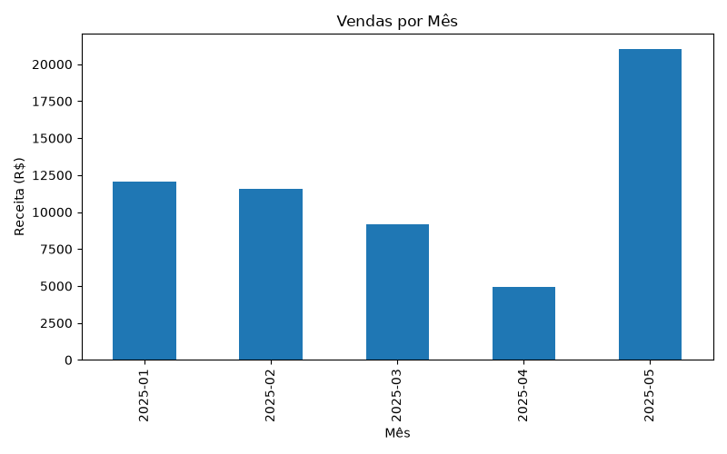

# Sales Analysis

[](https://www.python.org/)

A professional Python project for analyzing sales data from a CSV dataset using Pandas. Calculates business metrics and generates charts with Matplotlib to support data-driven decision-making.

---

## ✨ Features

- Load sales data from a CSV file
- Parse date columns automatically
- Calculate revenue for each sale
- Aggregate sales by month
- Aggregate sales by product
- Identify the best-selling product
- Identify the product with the highest revenue
- Generate monthly sales charts
- Generate Top 5 products by revenue charts
- Save generated charts as PNG images

---

## 🛠 Technologies Used

- Python 3.10+
- Pandas
- Matplotlib

---

## 📂 Project Structure

```text
sales_analysis/
│
├── parse.py             # Main analysis script
├── vendas.csv           # Sample sales dataset
├── venda_por_mes.png    # Generated monthly sales chart
├── top5_produtos.png    # Generated Top 5 products chart
├── README.md            # Project documentation
├── requirements.txt     # Project dependencies
└── .gitignore           # Git ignore rules
```

---

## 🚀 Installation

1. Clone the repository:

```bash
git clone https://github.com/Linck-creator/cursor-ai-python-journey.git
cd cursor-ai-python-journey/sales_analysis
```

2. (Optional) Create and activate a virtual environment.

<details>
  <summary>Windows (PowerShell)</summary>

```bash
python -m venv venv
.\venv\Scripts\Activate.ps1
```

</details>

<details>
  <summary>Unix / macOS</summary>

```bash
python -m venv venv
source venv/bin/activate
```

</details>

3. Install dependencies:

```bash
pip install -r requirements.txt
```
> This project requires **Pandas** and **Matplotlib**. Install the dependencies using the provided `requirements.txt` file before running the script.

---

## ▶️ Usage

To analyze sales data and generate business insights and charts:

```bash
python parse.py
```

The script will:

- Load the CSV dataset
- Perform sales data analysis
- Print business insights to the console
- Generate two charts (monthly sales and top 5 products by revenue)
- Save both charts as PNG images

---

## 📸 Preview

### Monthly Sales Revenue



This chart shows the revenue aggregated by month based on the sales dataset.

### Top Products by Revenue


This chart shows the top products ranked by total revenue.

---

## 📚 Learning Objectives

- Data analysis with Pandas
- Working with DataFrames
- Reading CSV files
- Data aggregation
- Business metrics
- Data visualization
- Matplotlib
- GroupBy operations
- Business data analysis

---

## 🔮 Future Improvements

- Interactive charts
- Dashboard generation
- Export reports to Excel
- Command-line arguments
- Additional business KPIs
- Data filtering options
- Support larger datasets

---

## 👨‍💻 Author

Developed by **Felipe Coelho Linck**

Administration Student | Python Developer | AI-Assisted Software Development

Created during the **Cursor AI + Python: Intelligent Development with AI** course provided by **Santander Open Academy**.

━━━━━━━━━━━━━━━━━━━━━━━━━━━━━━━━━━━━━━