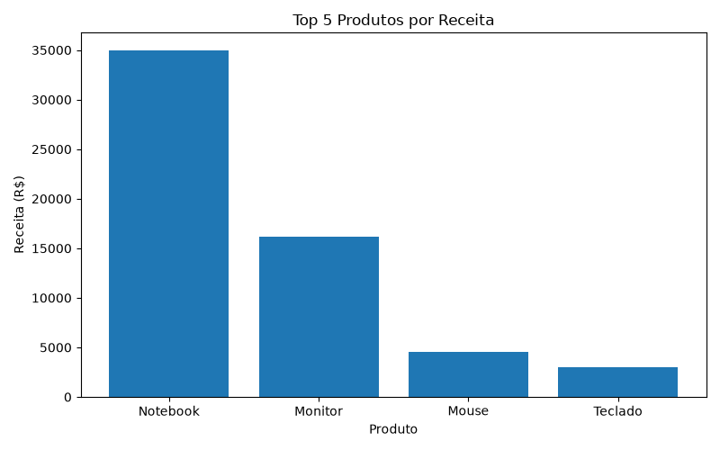

# Sales Analysis Project

Projeto desenvolvido em Python utilizando Pandas e Matplotlib para análise de vendas mensais.

## Resultados Obtidos

- Produto mais vendido: Mouse
- Produto com maior receita: Notebook
- Mês com maior faturamento: Maio de 2025

## Análise

Os dados demonstram que o produto Notebook foi responsável pela maior receita da empresa, enquanto o Mouse apresentou o maior volume de vendas. Observa-se também um crescimento significativo no faturamento durante o mês de maio, indicando um possível aumento da demanda ou realização de campanhas promocionais.

A utilização do Pandas permitiu consolidar os dados de vendas e gerar indicadores relevantes para apoio à tomada de decisão, enquanto o Matplotlib possibilitou a visualização gráfica dos resultados obtidos.

## Gráficos

### Vendas por mês

### Top produtos por receita

