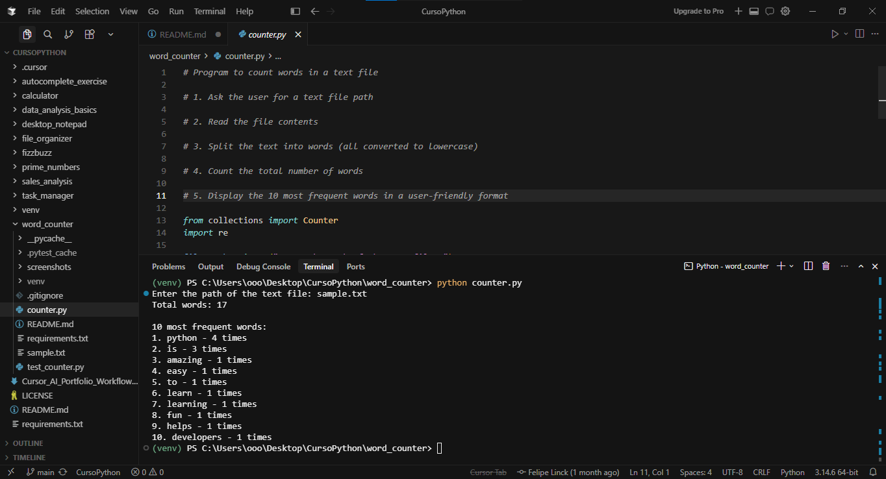

# Word Counter

[](https://www.python.org/)

A simple Python command-line application for text analysis. This tool reads a user-specified text file, processes the text content, counts the total number of words, and reports the 10 most frequent words. It demonstrates core Python concepts including user input, file reading, text normalization to lowercase, regular expressions for word extraction, word frequency analysis with `collections.Counter`, and error handling for missing files.

## ✨ Features

- Prompts the user for the path to a text file
- Reads and processes the contents of the specified file
- Converts all text to lowercase for case-insensitive analysis
- Extracts words using regular expressions
- Counts the total number of words in the file
- Calculates word frequencies and displays the 10 most frequent words with counts
- Uses `collections.Counter` for efficient frequency calculation
- Handles missing files gracefully with a clear error message

## 🛠 Technologies Used

- Python 3.10+
- Python Standard Library
  - `collections.Counter`
  - `re` (regular expressions)

> This project uses only the Python Standard Library. No external packages are required at runtime.

## 📂 Project Structure

```
word_counter/
├── counter.py               # Main script: command-line word counter
├── test_counter.py          # Auxiliary WordCounter class and unit tests
├── sample.txt               # Example text file for demonstration
├── screenshots/
│   └── word_counter_preview.png  # Screenshot of the program in action
├── README.md                # Project documentation
├── requirements.txt         # (Optional) List of dependencies; none required at runtime
└── .gitignore               # Standard Python and editor ignore rules
```

## 🚀 Installation

1. Clone the repository:
   ```bash
   git clone https://github.com/Linck-creator/cursor-ai-python-journey.git
   cd cursor-ai-python-journey/word_counter
   ```

2. (Optional) Set up a virtual environment:

<details>
<summary>Windows (PowerShell)</summary>

```powershell
python -m venv venv
.\venv\Scripts\Activate.ps1
```
</details>

<details>
<summary>Unix / macOS</summary>

```bash
python -m venv venv
source venv/bin/activate
```
</details>

> No external dependencies are required to run the application.

## ▶️ Usage

1. Run the word counter script:
   ```bash
   python counter.py
   ```
2. Enter the path to your text file when prompted (e.g., `sample.txt`).

**Example session:**
```
Enter the path of the text file: sample.txt
Total words: 17

10 most frequent words:
1. python - 4 times
2. is - 3 times
3. amazing - 1 times
4. easy - 1 times
...
```

The included `sample.txt` file can be used to try out the program.

## 📸 Preview

### Word Counter Execution



The screenshot shows the Word Counter running in the terminal, analyzing a sample file, displaying the total word count, and listing the 10 most frequent words.

## 📚 Learning Objectives

- Reading text files and user input in Python
- String manipulation and lowercase normalization
- Extracting words with regular expressions
- Counting words and analyzing word frequency
- Using `collections.Counter` for tallies
- Handling file-related exceptions
- Writing basic assertion-based tests for an auxiliary WordCounter class

## 🔮 Future Improvements

- Support for additional file encodings
- Allow configuring the number of most frequent words displayed
- Add support for command-line arguments
- Enhanced text preprocessing (e.g., more robust tokenization, optional exclusion of stop words)
- Export analysis results (e.g., to CSV or JSON)
- Provide additional text statistics (character count, line count)
- Visualization of word frequency distributions

## 👨‍💻 Author

Developed by **Felipe Coelho Linck**  
Administration Student | Python Developer | AI-Assisted Software Development

Created during the **Cursor AI + Python: Intelligent Development with AI** course provided by **Santander Open Academy**